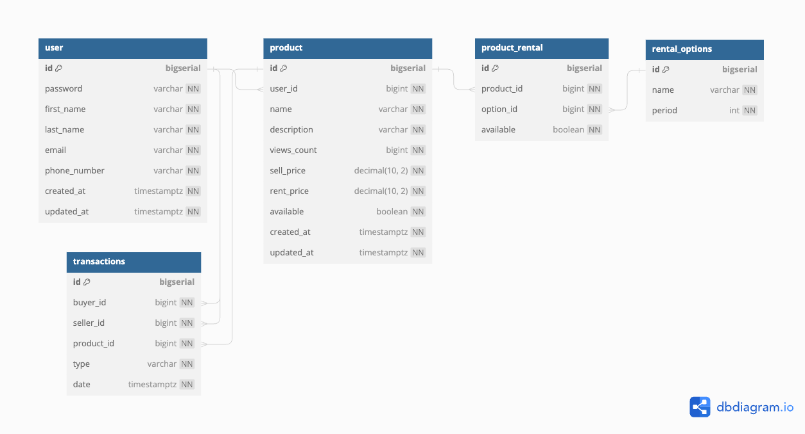

# Teebay

> Two tier node app communicating via graphql

## Run locally

```bash
git clone git@github.com:TusharIbtekar/teebay.git
mv .env.example .env
docker compose up -d
```

Visit http://localhost:4000/graphql to interact with the graphql interface provided by `apollo`

## Backend

- Node.js
- Express.js
- Typescript
- GraphQL
- Prisma
- Zod

## Database

- PostgreSQL

Initial DB model



## Frontend

Planned,

- React.js
- Typescript
- Vite
- React-hook-form
- Zod
- TailwindCSS
- Mantine

### Todos

- [ ] Setup monorepo with shared deps
- [ ] Share ESLint & Prettier config from monorepo
